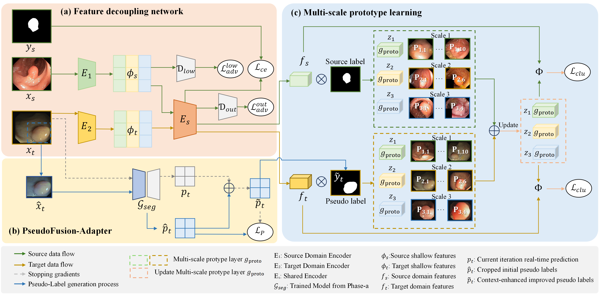
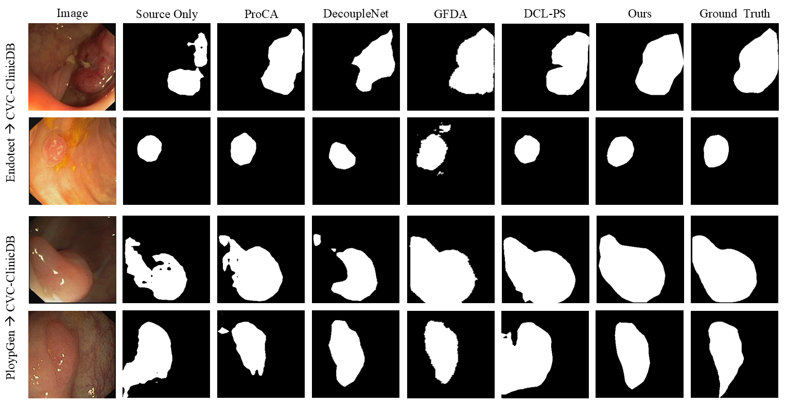

# FD-MSP
Feature Decoupling with Multi-Scale Prototype for Domain Adaptive Polyp Segmentation

## Overview
FD-MSP is a domain adaptive segmentation framework for medical polyp segmentation. It combines feature decoupling strategies with multi-scale prototype learning to achieve robust cross-domain polyp detection and segmentation.

<div align="center">
  
  <p><i>Figure 1: Overview of the FD-MSP framework</i></p>
</div>


## Installation

### Requirements
```bash
pip install -r requirements.txt
```

### Pretrained Models
Download the pretrained ResNet101 backbone:
```bash
mkdir pretrained && cd pretrained
wget https://download.pytorch.org/models/resnet101-5d3b4d8f.pth
```

## Training

### Phase 1: Feature Extraction Training
```bash
python train_phase1.py \
    --snapshot-dir ./snapshots/phase1 \
    --batch-size 4 \
    --gpus 0,1 \
    --dist \
    --tensorboard
```

### Phase 2: Soft Pseudo Label Training
```bash
# Generate soft pseudo labels
python generate_soft_label.py \
    --resume ./snapshots/phase1/best_model.pth \
    --output_folder ./datasets/soft_labels

# Train with soft labels
python train_phase2.py \
    --snapshot-dir ./snapshots/phase2 \
    --batch-size 4 \
    --resume ./snapshots/phase1/best_model.pth \
    --soft_labels_folder ./datasets/soft_labels
```

### Phase 3: Multi-Scale Prototype Refinement
```bash
bash run_phase3.sh
```

## Validation
```bash
python validate_phase3.py \
    --model_path ./snapshots/phase3/best_model.pth \
    --output_dir ./validation_results
```

## Testing
```bash
python test_phase3.py \
    --model_path ./snapshots/phase3/best_model.pth \
    --test_dataset CVC-ClinicDB
```

## Project Structure
```
FD-MSP/
├── model/              # Network architectures
├── data/               # Dataset loaders
├── utils/              # Utility functions
├── train_phase*.py     # Training scripts
├── validate_phase3.py  # Validation script
├── test_phase3.py      # Testing script
└── requirements.txt    # Dependencies
```


## Qualitative Results
<div align="center">
  
  <p><i>Figure 2: Qualitative segmentation results on polyp datasets</i></p>
</div>


## License
See LICENSE file for details.


